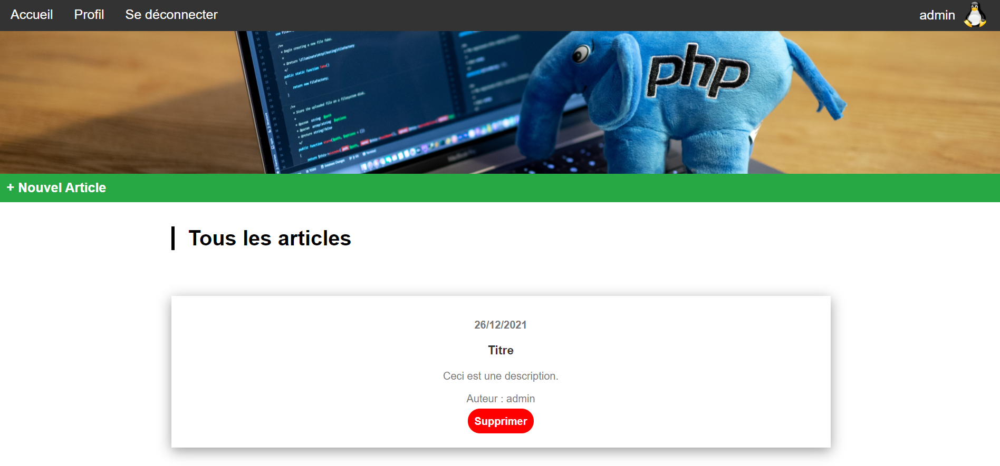
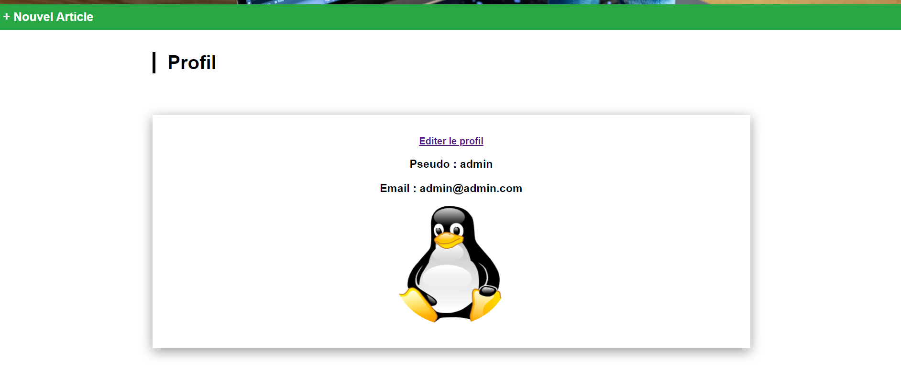
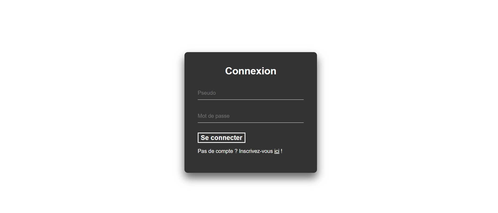

# **Projet final PHP**

---

### Membres du groupe:

Peyrataud Enzo | Léo Bourin | Théo Lopez

  

---

  

## Présentation du projet

  

- Le projet consiste à créer un site en Php où les utilisateurs pourront communiquer par le biais d'articles.

  

### Procédure d'installation

  

### I) Prérequis de base

- avoir  **WAMP / XAMPP** pour Windows (Version PHP 8) / **MAMP** pour MAC / **LAMP** pour Linux 

- avoir PhpMyAdmin

- Avoir un moteur de recherche pour rejoindre le site

- Avoir le dossier contenant les fichiers nécessaires (dossier `php_exam` qui contient les fichiers)

> lien vers le repo contenant les fichiers nécessaires : https://git.ytrack.learn.ynov.com/EPEYRATAUD/Projet_PHP_B2

**:warning: IMPORTANT: tous les fichiers nécessaires au fonctionnement du site doivent se trouver dans le même dossier.**

### II) Lancer le serveur

-  lancer le logiciel permettant de créer un serveur WEB en local
-  importer la base de donnée dans le dossier sql, la base doit s'appeler "php_exam_db"
  
Une fois le logiciel démarré, le rejoindre en écrivant "localhost/php_exam" dans votre moteur de recherche.

### III) Exemples d'utilisation

